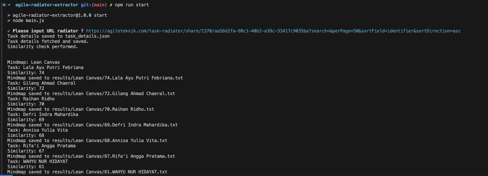
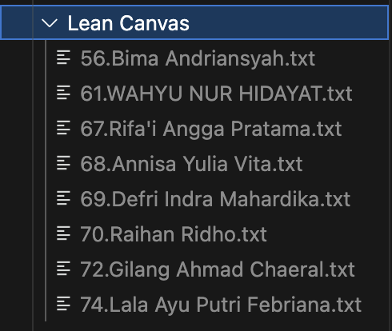
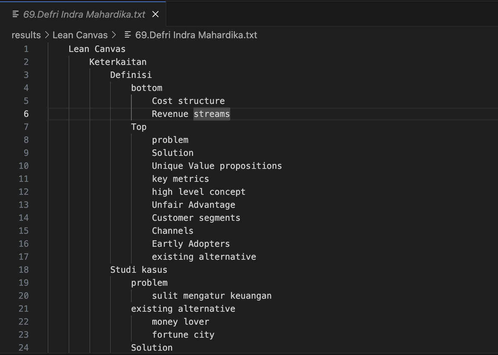

# AgileTeknik Radiator Extractor

## Description
Tools to extract information from agileteknik radiators

## Requirements

1. NodeJS
2. Radiator URL eg: `https://agileteknik.com/task-radiator/share/1370/aa56d2fa-98c1-40b2-a39c-33417c9035ba?search=&perPage=50&sortField=identifier&sortDirection=asc`

## Installation

1. Clone this repository
```bash
git clone https://github.com/defrindr/agile-radiator-extractor.git
```

2. Open directory
```bash
cd agile-radiator-extractor
```

3. Install dependencies
```
npm install
```

4. Try to test
```
npm run start
```

## Results

1. Running program

    

2. Result files

    
    
    Format file {similarity}.{name}.txt

3. Mindmap file

    